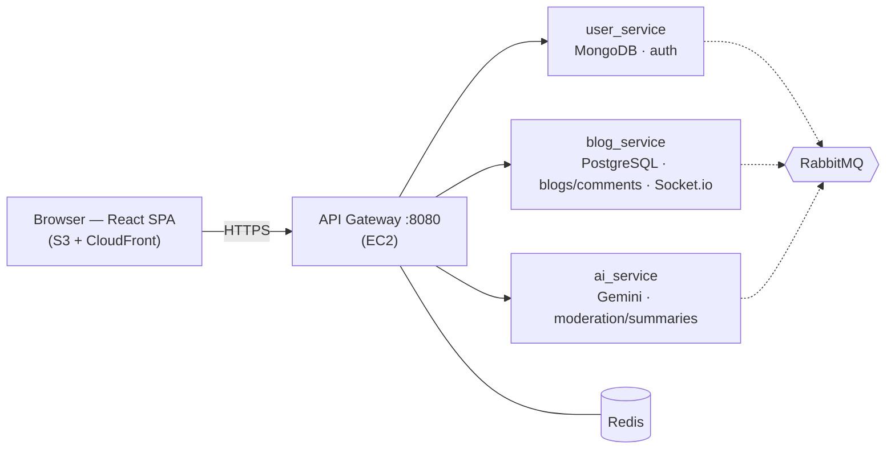

# Blogify — Multi-Author Blog Platform

A microservices-based blogging platform: a Node.js/Express backend (4 services behind one gateway) and a React SPA frontend, independently built, deployed, and versioned. This repo is an **umbrella/index** — each half lives in, and is maintained from, its own dedicated repository (added here as git submodules), so either can ship on its own schedule without touching the other.

| | Repo | Deployed to |
|---|---|---|
| Backend | [blogify-microservices-backend](https://github.com/anupamsingh-engineer/blogify-microservices-backend) → [`backend/`](backend) | AWS EC2 (Docker Compose + nginx) |
| Frontend | [blogify-microservices-frontend](https://github.com/anupamsingh-engineer/blogify-microservices-frontend) → [`frontend/`](frontend) | AWS S3 + CloudFront |

## Architecture



## Backend — 4 microservices behind one gateway

- **gateway** — single client-facing entry point: reverse proxy, edge auth, shared rate limiting, WS proxy
- **user_service** (MongoDB) — identity, auth, account management
- **blog_service** (PostgreSQL) — blogs, comments, saved blogs, real-time notifications (Socket.io)
- **ai_service** (stateless) — Gemini-powered summaries + async comment moderation
- Each service owns its data exclusively — no shared tables, no joins across services; cross-service calls are JWT + one circuit-breaker-wrapped HTTP call + RabbitMQ events
- Full observability sidecar: Prometheus, Grafana, Loki, Tempo, OpenTelemetry

**→ [Backend README](https://github.com/anupamsingh-engineer/blogify-microservices-backend/blob/main/README.md)**

## Frontend — React 19 SPA

- Redux Toolkit (2 hand-written slices) + **3 RTK Query API instances**, one per backend service, mirroring the backend's own boundaries
- Ant Design v6, Vite 7, React Router v7, Framer Motion, `socket.io-client` for live notifications
- Route-protected via a single `AuthGuard`; all real authorization still re-checked server-side

**→ [Frontend README](https://github.com/anupamsingh-engineer/blogify-microservices-frontend/blob/main/README.md)**

## Auth — key practices

- **JWT access + refresh, with rotation** — short-lived access token, refresh token rotated on every use, reuse triggers session invalidation
- **Split-trust token storage** — access token in memory/Redux (short-lived, XSS-exposed but low value); refresh token in an `httpOnly`, cookie-path-scoped cookie (never touchable by JS)
- **Mutex-guarded silent refresh** — an `async-mutex` lock on the client ensures concurrent `401`s trigger exactly one `/refresh` call, avoiding a refresh-token-rotation race that would otherwise kill the session
- **CSRF double-submit cookie** + `bcrypt` password hashing
- **Redis-backed token blacklist** for logout/revocation, checked at the gateway (fails open if Redis is down — availability over hard-locking auth)
- **Defense in depth** — the gateway strips spoofable headers and checks the blacklist, but every downstream service independently re-verifies the JWT signature; nothing trusts the gateway blindly

## Docker & CI/CD

- **Docker** — multi-stage builds, non-root users, healthchecks; one root `docker-compose.yml` runs the full backend stack, each service also has its own standalone compose file for isolated dev
- **Backend CI/CD** (GitHub Actions) — every push/PR: install → build all 4 Dockerfiles → validate compose; on push to `main`: SSH deploy to EC2 (`git pull && docker compose up -d --build`)
- **Frontend CI/CD** (GitHub Actions) — every PR: lint + build (no AWS credentials touched); on push to `main`: build → sync `dist/` to S3 (content-hashed assets cached 1yr, `index.html` never cached) → invalidate `index.html`/`/` in CloudFront

## Deployment

- **Backend → EC2**: single instance running the whole Docker Compose stack, nginx on the host for TLS termination (Let's Encrypt)
- **Frontend → S3 + CloudFront**: private S3 bucket (all public access blocked), CloudFront is the only reader via Origin Access Control, ACM cert for custom HTTPS domain

## Using this repo

Backend and frontend are wired in as **git submodules** — cloning this repo does not duplicate their history, and each can still be cloned, developed, and deployed entirely on its own.

```bash
git clone --recurse-submodules <this-repo-url>
# or, if already cloned:
git submodule update --init --recursive
```

Pushing changes still happens inside `backend/` or `frontend/` against their own `origin` — this repo only tracks *which commit* of each is currently referenced.
